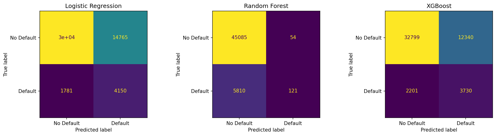
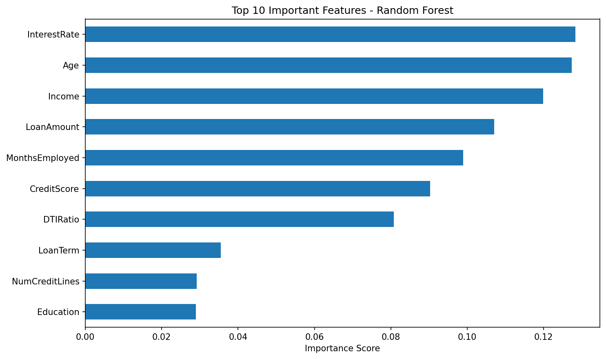
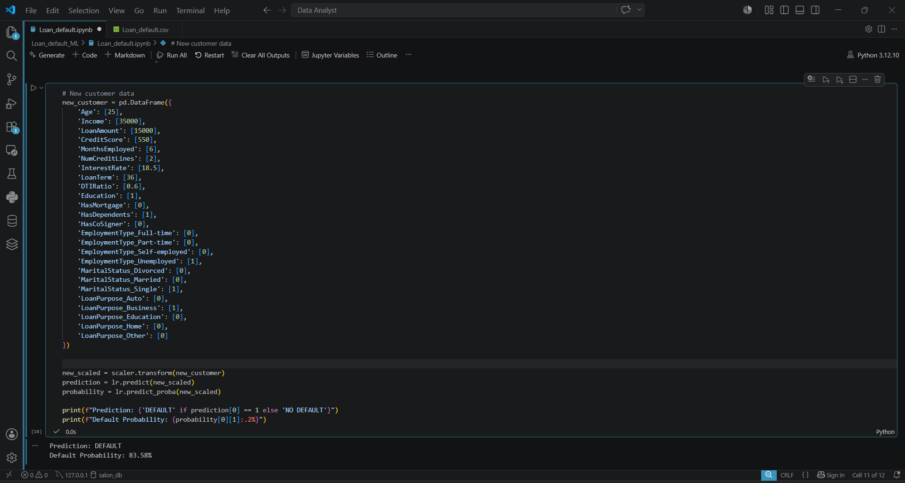

# 🏦 Loan Default Prediction — End-to-End ML Pipeline

> Predicting loan defaulters using a full machine learning pipeline — from raw data exploration to a deployed Flask REST API.


---

## 📌 Problem Statement

Financial institutions face significant losses due to loan defaults. This project builds a classification model to predict whether a borrower will default, with a strong focus on **maximizing recall for defaulters** — because missing a true defaulter is far more costly than a false alarm.

---

## 📊 Dataset

| Property | Value |
|---|---|
| File | `Loan_default.csv` |
| Rows | 255,347 |
| Target | `loan_status` (Default / No Default) |
| Features | Credit score, income, loan amount, DTI ratio, employment length, etc. |

---

## 📁 Project Structure

```
loan-default-prediction/
│
├── templates/                        # Flask HTML templates
├── app.py                            # Flask REST API
├── Loan_default.ipynb                # Full ML pipeline notebook
├── Loan_default.csv                  # Dataset
│
├── logistic_regression_model.pkl     # Trained Logistic Regression model
├── random_forest_model.pkl           # Trained Random Forest model
├── xgboost_model.pkl                 # Trained XGBoost model
├── scaler.pkl                        # Fitted StandardScaler
│
├── confusion_matrix_comparison.png   # Model evaluation visual
├── feature_importance.png            # Feature importance chart
├── Report.png                        # Summary report visual
│
├── Screen Record.mp4                 # Demo walkthrough
└── README.md
```

---

## 🔍 Workflow

### 1. Exploratory Data Analysis
- Class imbalance analysis (default vs no default distribution)
- Correlation heatmap and feature ranking
- Missing value treatment and outlier detection
- Key finding: DTI ratio, credit score, and loan-to-income ratio are the strongest predictors

### 2. Preprocessing
- Label encoding and one-hot encoding for categorical variables
- Feature scaling using `StandardScaler` (saved as `scaler.pkl`)
- Stratified train/test split (80/20)

### 3. Model Training & Comparison

| Model | Accuracy | Recall (Defaulters) | Notes |
|---|---|---|---|
| Logistic Regression | ~89% | **Highest** | ✅ Selected model |
| Random Forest | ~91% | Moderate | High accuracy, lower defaulter recall |
| XGBoost | ~92% | Lower | Best overall accuracy, not best for recall |

> ✅ **Logistic Regression was selected** — despite XGBoost having the highest overall accuracy, Logistic Regression achieved the best **recall for defaulters**, which is the business-critical metric in loan risk.

### 4. Evaluation

**Confusion Matrix Comparison:**



**Feature Importance:**



**Summary Report:**



---

## 🚀 Flask API

**Run the app:**
```bash
python app.py
```

**Predict endpoint:** `POST /predict`

**Sample request:**
```bash
curl -X POST http://localhost:5000/predict \
  -H "Content-Type: application/json" \
  -d '{"credit_score": 620, "income": 45000, "loan_amount": 15000, "dti_ratio": 0.35, "employment_length": 3}'
```

**Sample response:**
```json
{
  "prediction": "Default",
  "probability": 0.73
}
```

---

## 🛠️ Tech Stack

- **Data Analysis:** Python, Pandas, NumPy
- **Visualization:** Matplotlib, Seaborn
- **Modeling:** Scikit-learn, XGBoost
- **Deployment:** Flask
- **Environment:** Jupyter Notebook

---

## 📦 Installation

```bash
git clone https://github.com/SUJANC-17/loan-default-prediction.git
cd loan-default-prediction
pip install -r requirements.txt
python app.py
```

---

## 🎥 Demo

A full screen recording walkthrough is included in `Screen Record.mp4`.

---

## 📈 Key Takeaways

- Accuracy alone is a poor metric for imbalanced classification — **recall matters more** in financial risk
- Logistic Regression, despite being simpler, outperformed complex models on the metric that actually matters
- End-to-end deployment bridges the gap between a notebook experiment and a usable product

---

## 👤 Author

**Sujan C** — B.E. CSE, SKCET Coimbatore (2024–2028)

[](https://github.com/SUJANC-17)
[](https://linkedin.com/in/sujan-c-195834377)
